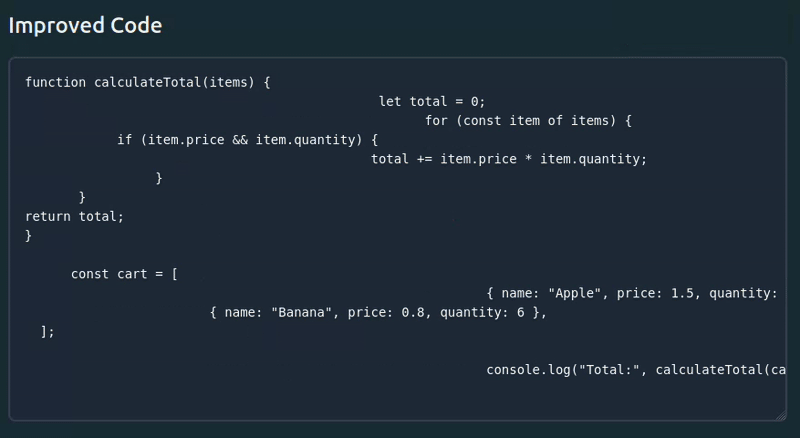

🪓 Uglier

    “Have you ever looked at some code and thought, ‘Wow, this is so clean and readable!’?
    Well, good news, random citizen… Not anymore.”

🔥 Introducing Uglier

A web abomination inspired by the beloved VS Code extension Prettier and built in React.
But unlike Prettier, Uglier makes your code look like it wasn't written by AI.

💡 What Does It Do?

Uglier takes your perfectly fine code… and ruins it.

    Want your indentation to be a mess? ✅
    Tired of moving eyes across screen? ✅
    obsessed with inline codes?✅
    Want to easily transform your JS code to Python and PHP? ✅

This tool is pointless But hey — not everything needs a reason to exist. Uglier exists because you deserve love, even if your code doesn't.

🎭 Meet the Mascot

A seasoned executioner (which i would draw if I had skills to it).
Uglier mutilates your code and yet somehow keeps it running! (won't fix it if it wasn't running tho)

The result?
A monstrosity that would make even the most battle-hardened developers claw their eyes out in despair.

⚠️ This project has NO practical use whatsoever.

Seriously.
Don’t use it in production.
Unless you hate your team.
Or yourself.

📝 SIDENOTE

This is not a diss to Prettier.
We love Prettier.
Please don’t sue me.

🔗 Try It Out!

👉 https://uglier.netlify.app/

Or Run It Locally:
Clone the repo and fire it up in just two commands:

    npm i
    npm run dev
